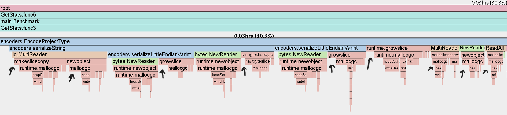
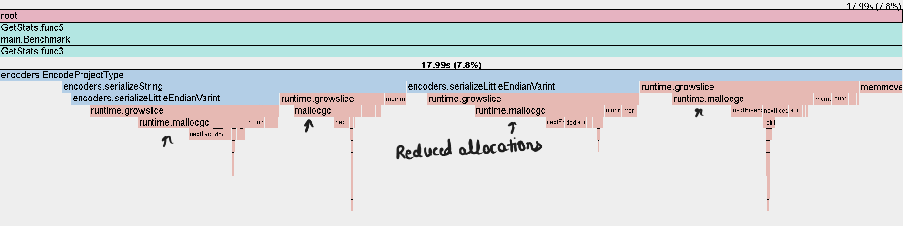

# Protocol Buffers from Scratch

## Description

Developed a set of encoders/decoders with aim to implement protocol buffers from scratch and to make it's encoding/decoding faster than that of json's with reduced payload size through the use of binary

## Features

- Protobuf serialization and deserialization
- Performance benchmarking
- Optimization to reduce latency spikes
- Profiling with pprof
- Visual performance comparisons

## Installation

Clone the repository and install dependencies:

```sh
git clone https://github.com/AnuragProg/protobuf-from-scratch
cd protobuf-from-scratch
go mod download
```

## Usage

Run the client, which in turn uses builtin ```encoding/json``` go library to compare it with custom implemented encoders and decoders of protobuf

```sh
make client
```

Result of which is ```cpu.prof``` file which can be viewed through ```go tool pprof -http=:3000 cpu.prof```

## Optimizations (Mistakes that led to latency spikes in encoding/decoding and their fixes)

Context: We have a type name `ProjectType` with schema
```go
type ProjectType struct {
	Name        string   `json:"name"`
	Description string   `json:"description"`
	Timestamp   uint64   `json:"timestamp"`
	Tags        []string `json:"tags"`
}
```
that we are serializing/deserializing using custom encoders/decoders (```encoders.*```) and ```encoding/json``` encoders/decoders

*Note: methods of type ```encoders.*``` are to be focused on as they are the ones we are trying to optimize, e.g. encoders.EncodeProjectType, encoders.serializeString, etc*

### Optimization 1

Cause: Was returning ```io.Reader``` as result of serialization of fields, resulting in frequent reads from reader anytime we need to process the underlying bytes, resulting in large allocations for new slices

Fix: Returned ```[]byte``` directly, preventing overhead of frequent reads from the reader to access it

#### Before Optimization:



#### After Optimization:




### Optimization 2

Cause: Multiple huge allocations causing latency spikes due to mallocs, slice resizing & copying of underlying data in newly resized slice

Fix: Use of single buffer, and enforcing all the subsequent serializers to use it directly to push the results to

#### Before Optimization (comparison with ```encoding/json```'s Marshal):


#### After Optimization:


## Conclusion

    - Achieved faster encoding/decoding in comparison to ```encoding/json```

    - Achieved lesser payload size than that of json's

*Units - ms (milliseconds)*

```
Stats for small payload:
==================================================
Json 10000 concurrency: {Encodingp90:0 Encodingp95:0 Encodingp99:0 Decodingp90:0 Decodingp95:0 Decodingp99:0 Size:100}
Proto 10000 concurrency: {Encodingp90:0 Encodingp95:0 Encodingp99:0 Decodingp90:0 Decodingp95:0 Decodingp99:0 Size:47}
==================================================
Stats for large payload:
==================================================
Json 10000 concurrency: {Encodingp90:4765 Encodingp95:5121 Encodingp99:6748 Decodingp90:5853 Decodingp95:6076 Decodingp99:6184 Size:304960}
Proto 10000 concurrency: {Encodingp90:260 Encodingp95:283 Encodingp99:380 Decodingp90:0 Decodingp95:0 Decodingp99:0 Size:304912}
```

*Note - The difference in sizes is not so significant due to two reasons, 1. No. of fields were and their string representation were not that big. 2. The actual data was increased in the second case rather than the number of fields, hence giving such rate in terms of size.*
